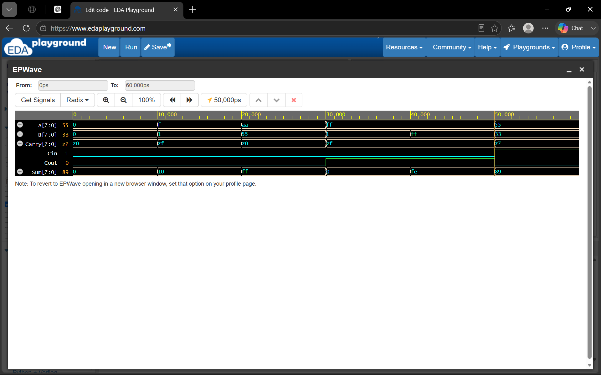
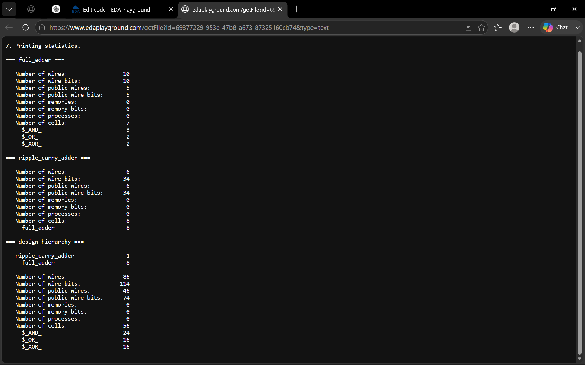

# 8-bit Ripple Carry Adder – Verilog HDL

## Project Overview

This project presents the design, functional verification, and RTL-to-gate-level synthesis of an **8-bit Ripple Carry Adder (RCA)** using Verilog HDL.

The design is constructed using eight 1-bit Full Adders connected in cascade. The carry output of each Full Adder is connected to the carry input of the next stage.

The project demonstrates a basic digital VLSI design flow from **RTL design to synthesized gate-level representation**.

---

## Objectives

- Design a 1-bit Full Adder using Verilog HDL.
- Construct an 8-bit Ripple Carry Adder using eight Full Adders.
- Verify the design using a Verilog testbench.
- Analyze simulation waveforms.
- Perform RTL synthesis using Yosys.
- Generate a synthesized gate-level Verilog netlist.
- Analyze the synthesized logic-cell statistics.

---

## Architecture

The 8-bit Ripple Carry Adder consists of:

```text
        ┌─────────────┐
A[0] ──►│ Full Adder  │──► Carry[0]
B[0] ──►│     FA0     │──► Sum[0]
Cin ───►│             │
        └──────┬──────┘
               │
               ▼
        ┌─────────────┐
A[1] ──►│ Full Adder  │──► Carry[1]
B[1] ──►│     FA1     │──► Sum[1]
        └──────┬──────┘
               │
              ...
               │
               ▼
        ┌─────────────┐
A[7] ──►│ Full Adder  │──► Cout
B[7] ──►│     FA7     │──► Sum[7]
        └─────────────┘

## Simulation Result

The 8-bit Ripple Carry Adder was functionally verified using Icarus Verilog and EPWave.



## Synthesis Result

RTL synthesis was performed using Yosys. The synthesized design contains 8 Full Adder blocks and 56 logic cells at the flattened gate level.



## Conclusion

The project successfully demonstrates the RTL design, simulation, verification, and synthesis of an 8-bit Ripple Carry Adder.
